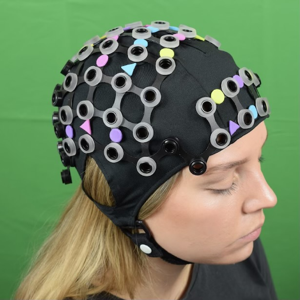
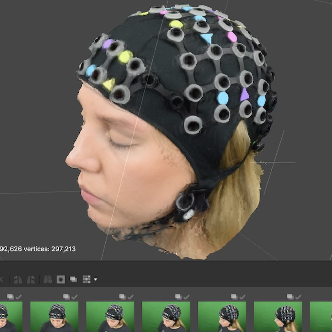
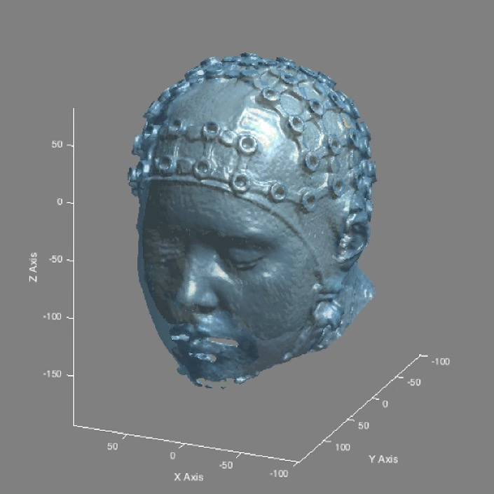

 
*Labs I am currently working in:* 
 

# [Developing Brain Lab](https://www.developingbrain.ca/) 
- Our research uses behavioural assessments & advanced brain imaging techniques to study cognitive development in infants and children
 

# [Culham Lab](http://www.culhamlab.com/)
- A major theme of the lab is Immersive Neuroscience: bringing cognitive neuroscience research closer to the real world. Our lab has developed unique techniques for bringing the "real world" into the constrained environment of the fMRI scanner and is moving in new directions with simulated reality and functional near-infrared spectroscopy. 

 
*Please find links to projects I have previously worked on below:*
 

# [Anthropomorphism and Theory-of-Mind](https://onlinelibrary.wiley.com/doi/10.1002/hbm.25542)

 

- [Preprint](https://psyarxiv.com/3uj4g/)
- [PDF](https://onlinelibrary.wiley.com/doi/10.1002/hbm.25542)
- [Preregistration](https://osf.io/tuq4a/)
- [NeuroVault](https://neurovault.org/collections/6615/)
- [Code](https://gitlab.com/hortensius/anthrom)
- [Dataset](https://osf.io/rg5kn/)

# [Photogrammetry for fNIRS](https://zenodo.org/record/4146985#.YiANgWRufvW)

- [Zenodo](https://zenodo.org/record/4146985#.YiANgWRufvW)
- A user guide to using photogrammetry for localisation of optode locations in functional near-infrared (fNIRS) studies. 

 
 

