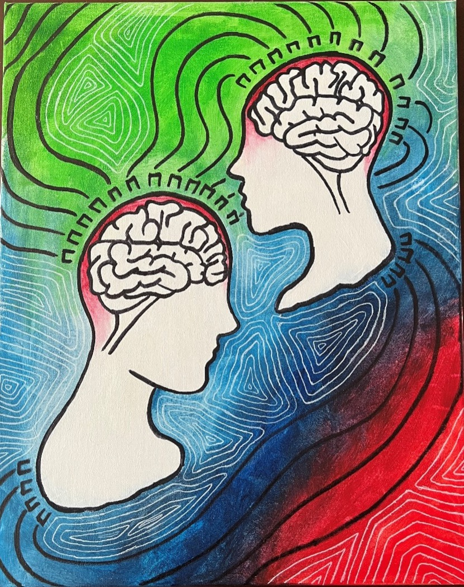

 
*This page will be updated with ongoing and upcoming Science Communication work.*
 
 

# Human Connection

This image was created as part of the Art-Science Collaboration hosted at Neuroscience Research Day, 2022. This is a unique opportunity for Neuroscience researchers to pair up with an artist and communicate their research through art. For more information and to see other artwork submissions please visit the website [here](https://songsuwo.ca/brain-art). 

 

   

 

Functional near-infrared spectroscopy (fNIRS) is a type of optical
neuroimaging that is becoming an increasingly popular method of
studying human brain function. Near-infrared light is shone into the
brain to measure blood flow, giving an indication of brain activation
during different tasks or events. Its advantages over other techniques
include that it allows for hyperscanning, or the simultaneous imaging of
two people’s brains as they interact. This allows researchers to look at
brain synchrony, often characterized by similar patterns of activity. This
is represented in the artwork where lines appear to “connect” the
brains, whilst also being representative of the physical fNIRS set up.
Likewise, the bright colours are representative of the activation seen in
different parts of the brain as areas “light up” when we communicate.
Michaela, a PhD student in the Neuroscience program, uses fNIRS to
study social interactions and the developing brain. For this, she
believes that face-to-face communication is key and her research
strives to allow neuroscience research to occur in more naturalistic
settings. Bringing together art and neuroscience, Audra has created a
piece that highlights some key aspects of brain research. The piece
was inspired by the process of communication and how we interact with
one another. Using images and references from Michaela’s research,
Audra was able to source inspiration that ties human connection together. 
The colour choice of blue, green and red comes from looking at images of 
brain scans and how certain areas of the brain are activated.
 
 
 

<left>
**Artist: Audra Bartel** *(Department of Visual Arts, Faculty of Arts & Humanities, Western University)*

**Scientist: Michaela Kent** *(Department of Neuroscience, Schulich School of Medicine & Dentistry, Western University)*
 