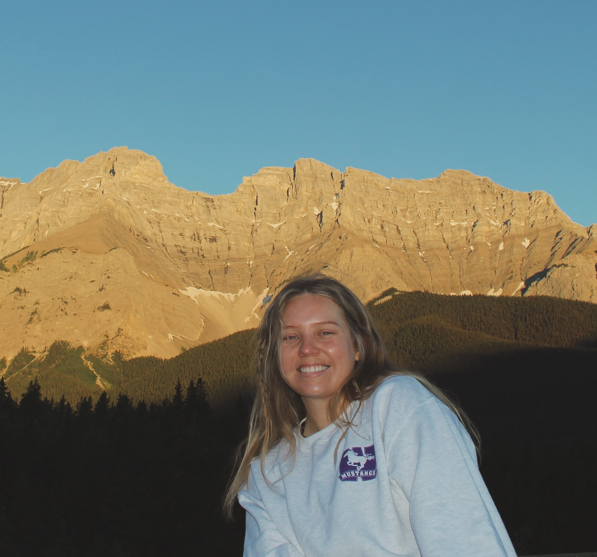
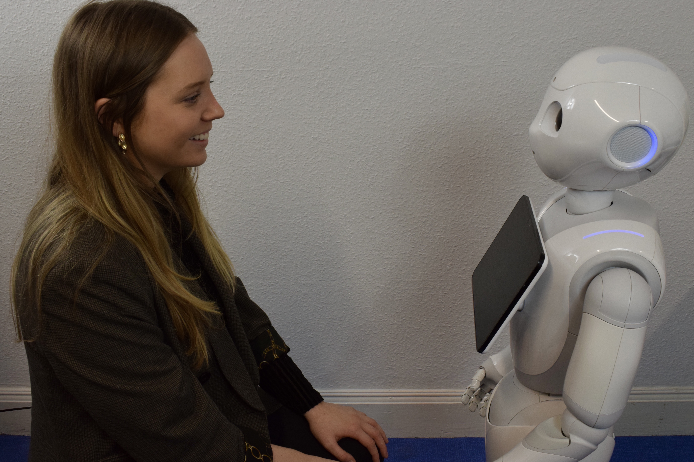

   

 
Michaela Kent is a PhD student in the Neuroscience program at Western University in London, Ontario, Canada. She is co-supervised by [Dr. Emma Duerden](https://www.developingbrain.ca/) and [Dr. Jody Culham](http://www.culhamlab.com/). 

Her interest in the developing brain has been a driving factor behind previous work. During an undergraduate degree at Glasgow Caledonian University, Michaela wrote a dissertation focussing on the neurodevelopment of children raised in orphanages. She then completed a Master's degree in Brain Science at the University of Glasgow, working primarily on a functional magnetic resonance imaging (fMRI) study exploring aspects of social cognition. Whilst in Glasgow, Michaela worked with [Dr. Ruud Hortensius](http://www.ruudhortensius.nl/) and as part of the [Social Brain in Action Lab](https://www.so-bots.com/) on their Social Robots research project. Building on her neuroimaging background, Michaela is now working to use functional near-infrared spectroscopy (fNIRS) to study the developing brain in naturalistic settings. Specifically, she uses fNIRS alongside behavioural measures to study how people interact in different environments. 

Outside of her research, Michaela serves as the Vice President for the [Society of Neuroscience Graduate Students](https://songsuwo.ca/execs) and a graduate teaching assistant at Western University. 

 

# Education

 
PhD *(Expected 2024)*, Western University, London, Ontario, Canada

MSc *(2019, with Distinction)*, University of Glasgow, Glasgow, Scotland, UK

BSc *(2018, First Class Honours)*, Glasgow Caledonian University, Glasgow, Scotland, UK
 
 

 

