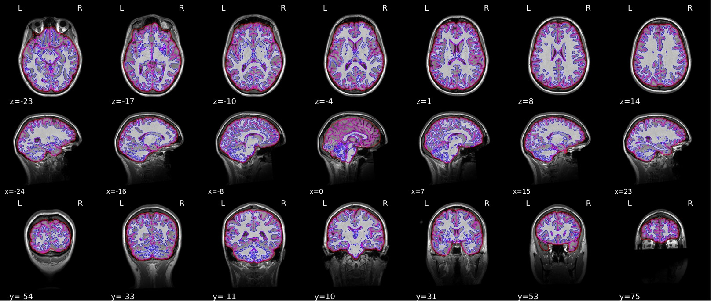

 

Please feel free to [email me](mailto:mkent28@uwo.ca), reach out on [Twitter](https://twitter.com/michaelakent_) or [LinkedIn](https://www.linkedin.com/in/michaelakent/)! 

This website was created using R markdown and is hosted on github. Please let me know if you notice any issues or broken links.

<a class="twitter-timeline" data-width="500" data-height="400" data-theme="light" data-tweet-limit="5" href="https://twitter.com/michaelakent_">Tweets by @michaelakent_</a> 

