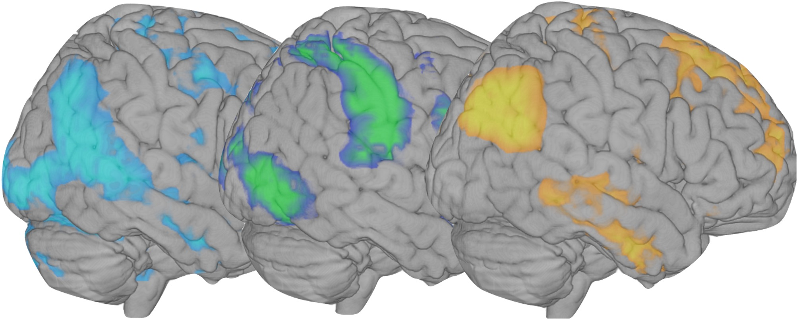
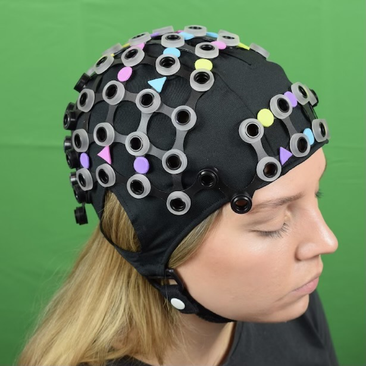
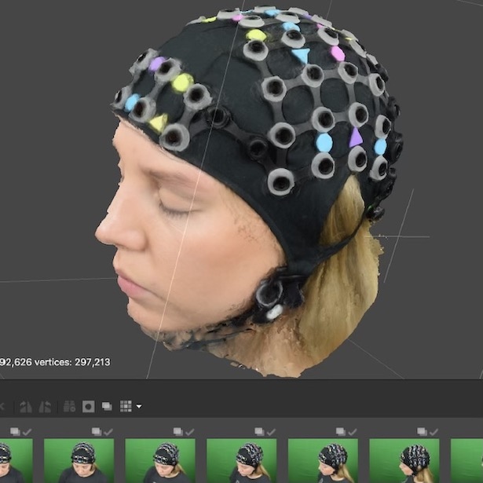
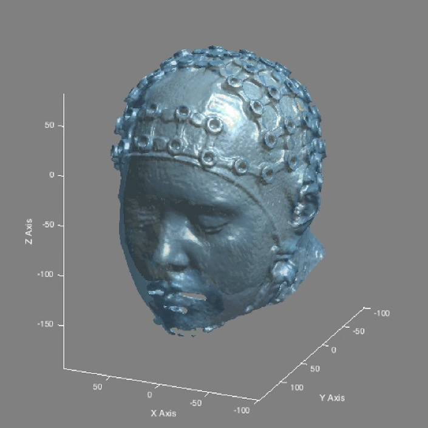

 
**Current labs:** 
 

**[Developing Brain Lab](https://www.developingbrain.ca/)** 

- Principal Investigator: [Dr. Emma Duerden](https://www.developingbrain.ca/)

- Our research uses behavioural assessments & advanced brain imaging techniques to study cognitive development in infants and children. In the DBL, Michaela is involved in neuroimaging studies of social cognition and also helps in the collection of brain data from newborn babies at Victoria Hospital. 
 
 

**[Culham Lab](http://www.culhamlab.com/)**

- Principal Investigator: [Dr. Jody Culham](http://www.culhamlab.com/)

- A major theme of the lab is Immersive Neuroscience: bringing cognitive neuroscience research closer to the real world. The Culham Lab has developed unique techniques for bringing the "real world" into the constrained environment of the fMRI scanner and is moving in new directions with simulated reality and functional near-infrared spectroscopy (fNIRS). In the Culham Lab, Michaela studies the effects of live interactions and visual realism on brain activation measured with optical neuroimaging.
 
 

**[Nelson Lab](https://www.childrenshospital.org/research/labs/nelson-laboratory-research)**

- Principal Investigator: [Dr. Charles Nelson](https://www.gse.harvard.edu/faculty/charles-nelson-iii)

- Michaela is currently a visiting researcher at the Laboratories of Cognitive Neuroscience at Boston Children's Hospital and Harvard Medical School. Here, she is working on the Emotion Project, which aims to examine whether individual differences in processing facial emotion in infancy are related to later developmental outcomes.
 
 

**Previous labs and projects:**
 
 
**[Social Brain in Action Lab](https://www.soba-lab.com/)** and **[Social Robots](https://www.so-bots.com/)**

- Principal Investigator: [Dr. Emily Cross](https://www.soba-lab.com/people)

- Supervisor: [Dr. Ruud Hortensius](http://www.ruudhortensius.nl/)

 
[Anthropomorphism and Theory-of-Mind](https://onlinelibrary.wiley.com/doi/10.1002/hbm.25542)

- The culmination of Michaela's Master's project at the University of Glasgow. Below are the resources for the publication "Exploring the relationship between anthropomorphism and theory-of-mind in brain and behaviour", Human Brain Mapping. 
- We place emphasis on open, reproducible science by sharing data and code.
 

- [PDF](https://onlinelibrary.wiley.com/doi/10.1002/hbm.25542)
- [Preprint](https://psyarxiv.com/3uj4g/)
- [Preregistration](https://osf.io/tuq4a/)
- [NeuroVault](https://neurovault.org/collections/6615/)
- [Code](https://gitlab.com/hortensius/anthrom)
- [Dataset](https://osf.io/rg5kn/)

 
[Photogrammetry for fNIRS](https://zenodo.org/record/4146985#.YiANgWRufvW)

- A user guide to using photogrammetry for localisation of optode locations in functional near-infrared (fNIRS) studies. 
- [Zenodo](https://zenodo.org/record/4146985#.YiANgWRufvW) link to PDF

 
 

